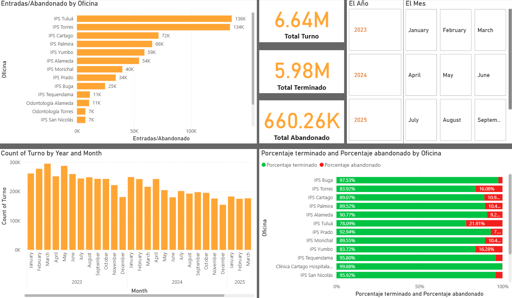
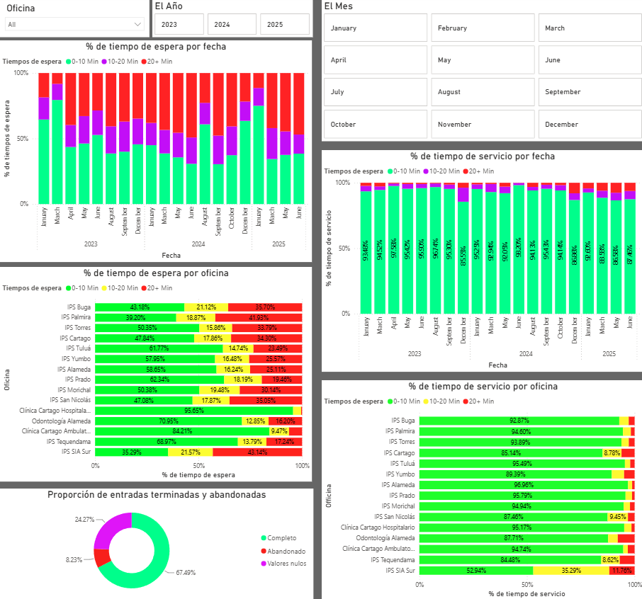

# Data Analytics and Pipeline Internship Project (2025)

## Project Overview
In summer of 2025, I worked remotely as a developer intern for **Dinámica y Desarrollo** (based in Bogota, Colombia) from the United States. I was tasked with extracting, cleaning, analyzing, and presenting historical data of customer fulfillment times and traffic loads across medical office branches for one of their clients.

## Tools and Technology
* **Python:** Automate the extraction and organization process of 11,000+ large JSON data packets
* **Power BI:** Constructed 2 client-facing dashboards displaying historical data across client medical branches, (Total Ticket Information across all branches, specific 'Wait & Serve' times of customer fulfillment across branches)

## Python Scripts
Due to the company's database only allowing each JSON data packet to hold data from within a 24 hour time perdiod, I built a custom Python script that would allow for these packets to be downloaded and organized within the file system automatically based on each branch within the company and spanning the nearly 3 year time period I was working with.

### Code Snippet: Parsing API Responses and Commiting Them to Local Storage
* Below is a localized snippet of the extraction loop. Sensitive endpoints and tokens have been redacted.
```python
        records = []
        for key, ticket in tickets_obj.items():
            customer = ticket.get("customer",{})
                ticket_flat = {
                    "Turno": ticket.get("name"),
                    "Estado": ticket.get("status"),
                    "Sede": ticket.get("branchName"),
                    "Línea actual": ticket.get("currentLineName"),
                    "Línea inicial": ticket.get("startLineName"),
                    "Fecha del Turno": datetime.utcfromtimestamp(ticket.get("issueDate", 0) / 1000).isoformat(), 
                    "CustomerName": customer.get("name"),
                    "CustomerLastName": customer.get("lastName"),
                    "CustomerDocId": customer.get("docId"),
                    "CustomerDocType": customer.get("docType")
                }
                records.append(ticket_flat)
                #Depriciated format has been left unchanged to preserve originality.
                #The modern equvilant of 'Fetcha del Turno' would be: 
                #"Fecha del Turno": datetime.fromtimestamp(ticket.get("issueDate", 0) / 1000, tz=UTC)
            

            fileName = f"{branch_name}_{month} {day} {year}.json" #Automatically names the file. 
            #Files had to be downloaded individually due to the constraints of the company database. 
            #A seperate merging program was created to resolve this.

            output_file = os.path.join(output_location, fileName) if output_location else fileName

            with open(output_file, "w", encoding="utf-8") as f:
                json.dump(records, f, ensure_ascii=False, indent=4)
            print(f"Saved{len(records)} tickets to '{output_file}'")
            day = day + 1 
        month = month + 1
        day = 1
    year = year + 1
    month = 1

completeSound = "D:\Quanty\Auto Downloader\complete.wav"
playsound (completeSound) #Automatically plays a notification sound to alert me when the download had finished. 
#This allowed me to focus on other aspects of the project while this worked in the background.
```
With over 11,000 individual JSON packets succesfully downloaded, I built a seperate merger to combine all isolated JSON files into unified datasets grouped by branch.

### JSON Packet Merger Script:

```python
import json
import os

inputFolder = r"D:\Quanty\Queries\Comfandi\Data Batches\Odontología Torres\Raw"
outputFolder = r"D:\Quanty\Queries\Comfandi\Data Batches\Odontología Torres\Merged"
fileNameOutput = "Odontología Torres_Merged.json" #Current Branch being worked on

os.makedirs(outputFolder, exist_ok=True)
#Makes a new directory but checks if one already exists

outputFile = os.path.join(outputFolder, fileNameOutput)
count = 0
mergedData = []

#Iterate through all JSON data packets
for filename in os.listdir(inputFolder):
    filePath = os.path.join(inputFolder, filename)
    with open(filePath, 'r', encoding='utf-8') as f:
        data = json.load(f)
        if isinstance(data, list):
            mergedData.extend(data)
            count += 1
            print(f"Extended {count} items")
        else:
            mergedData.append(data)
            count += 1
            print(f"Appended {count} items")

completeData = {
    "ticketsBatch":{
        "BatchId": "Odontología Torres", 
        "tickets": mergedData
    }
}

with open(outputFile, 'w', encoding='utf-8') as out_file:
    print ("Saving to file")
    json.dump(completeData, out_file, ensure_ascii=False, indent=4)
    
print(f"Merged{len(mergedData)} items into {outputFile}") #Informs user of successful output
```
## Power BI Dashboards
After extracting, cleaning, and organizing the data, it was loaded into Microsoft Power BI to create final visualizations that were presented to clients. I worked alongside management to ensure that these dashboards were meeting client needs.

### Total Tickets Across All Branches
Snapshot showing the dashboard presenting the total tickets (logged foot traffic) from the client over the 3 year timespan across all of its branches.


**Key Insights and Features:**
* Processed and visualized over 6.64 Million total tickets, spanning from 2023 to 2025.
* Provides a clear, top-level breakdown of competed vs abandoned tickets, 5.98 Million vs. 660.26 Thousand
* Includes interactive filtering by year and month, in addition to visualizations comparing ticket volume and completion rates across individual branches.

### Wait and Serve Times Across Branches
Snapshot showing the dashboard presenting the wait and serve times across the client's branches over the 3 year timespan.


**Key Insights and Features:**
* Seperates wait and service times into intuitive, color-coded sections that quickly identify operational bottlenecks.
* Visualized the percentage of wait and serve times by office and specific dates to help the client pinpoint exactly where and when delays have occured.
* Leverages donut chart to illustrate the overall proportion of completed, abandoned, and null entries.